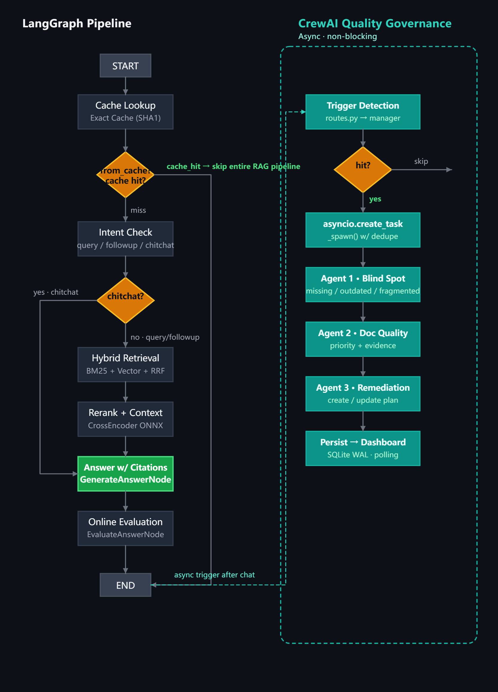
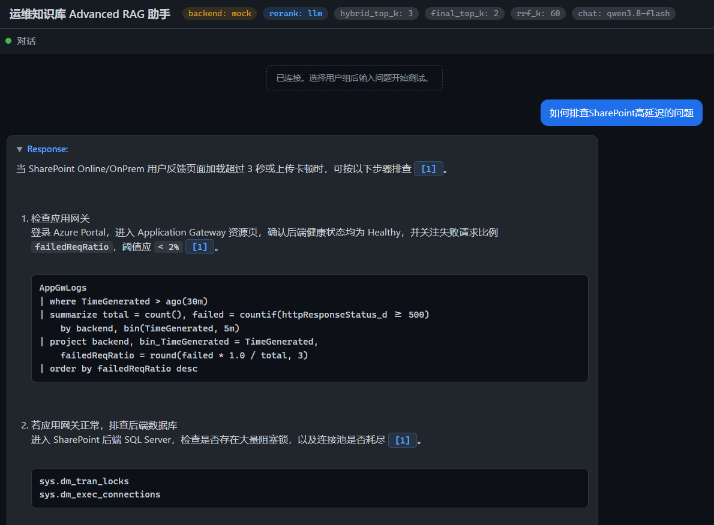
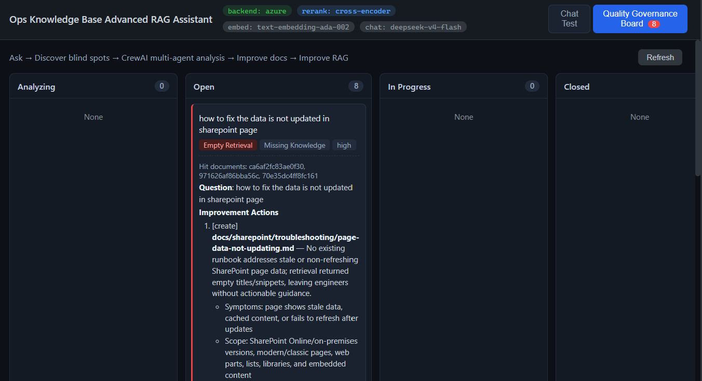

# OCECopilotAdvanceRAG

> Advanced RAG prototype for SRE knowledge bases — LangGraph + Azure AI Search + CrewAI governance.

[](https://www.python.org/)
[](https://github.com/langchain-ai/langgraph)
[](https://fastapi.tiangolo.com/)
[](https://learn.microsoft.com/en-us/azure/search/)
[](https://github.com/crewAIInc/crewAI)

A production-oriented RAG system that goes beyond naive vector search. Combines **intent routing**, **cross-encoder reranking**, **online self-evaluation**, and an asynchronous **CrewAI quality governance loop** that continuously closes the "poor answer → document gap → remediation" feedback cycle.

---

## ✨ Features

| Capability | What it does |
|---|---|
| **Exact Cache** | SHA1 single-turn cache with TTL tiers and `kb_version` isolation; hit short-circuits the entire RAG pipeline |
| Intent-aware routing | `chitchat` bypasses retrieval; empty retrieval skips LLM → saves tokens |
| Hybrid retrieval | Azure AI Search — `AZURE_SEARCH_MODE=vector` (pure embedding) or `hybrid` (BM25 + Vector + RRF); embedding source and dimension **must match** the ingestion path |
| Pluggable rerank | Cross-Encoder `BAAI/bge-reranker-base` (ONNX backend, 2-3x faster) / LLM / Semantic / none; before/after rank diff recorded |
| Citation-grounded answers | `[1] [2]` inline citations trace back to the exact document chunk |
| Role-based permission filter | OData filter on `allowed_groups` + post-retrieval assertion — sensitive docs never enter the LLM context |
| Online self-evaluation | Faithfulness / Answer Relevancy / Hallucination scored by LLM self-check (gated by `ENABLE_ONLINE_EVAL`) |
| **CrewAI quality governance** | **3-agent sequential Crew (Blind Spot → Doc Quality → Remediation)** fires **asynchronously** when answers fall below thresholds; status tracked in SQLite kanban |
| Full observability | Prometheus metrics (overall + cache-hit/miss grouped P95s) + structured terminal logs per LangGraph node |

## 🏗️ Architecture



LangGraph **entry point is `cache_lookup_node`** — before any intent check, the exact-cache (SHA1 hash of normalized question + `kb_version`) is consulted. On hit, the graph terminates at `END` immediately with zero token cost. On miss, it continues to `intent_check → {chitchat|query|followup} → retrieve → rerank → answer → evaluate → END`.

CrewAI does **not** live inside the LangGraph graph — it fires after `END` via `asyncio.create_task` in `routes.py` (`maybe_trigger_after_chat`), so governance is always non-blocking and deduplicated.

## 🛠️ Tech Stack

| Layer | Choice |
|---|---|
| Backend | Python 3.11 · FastAPI · LangGraph 0.2.34 |
| Retrieval | Azure AI Search (async SDK); `AZURE_SEARCH_MODE=vector` (pure) or `hybrid` (BM25+Vector+RRF) |
| Embedding | Azure `text-embedding-ada-002` · DashScope `text-embedding-v2` (both 1536-D; **pick one, stay consistent**) |
| Chat | DashScope qwen / DeepSeek / Azure OpenAI via OpenAI-compatible endpoint |
| Cache | `app/cache/exact_cache.py` — SHA1 key, TTL-tiered (realtime/general/static/reference), `kb_version` isolation |
| Rerank | Cross-Encoder `BAAI/bge-reranker-base` (**ONNX runtime backend**, 2-3x faster) · LLM · Semantic · none |
| Eval | LLM self-check (`EVALUATE_SYSTEM_PROMPT`) + offline (`backend/eval/`) via DeepEval / Ragas |
| Governance | CrewAI 0.175.0 (**optional**; install or leave out, main flow works either way) |
| Storage | SQLite (WAL) for governance task store |
| Metrics | Prometheus `/metrics` (overall + cache-hit/miss grouped P95s) |

## 📂 Directory

```
OCECopilotAdvanceRAG/
├── frontend/          # index.html (single-page, no build step)
├── backend/
│   ├── ingestion/     # Chunk + embed → Azure indexer
│   ├── eval/          # Offline retrieval + RAG evaluation
│   ├── src/app/
│   │   ├── graph/     # LangGraph: cache_lookup → intent_check → retrieve → rerank → answer → evaluate
│   │   ├── retrieval/ # Azure search (vector/hybrid) + rerank
│   │   ├── cache/     # ExactCache (SHA1 + TTL + kb_version)
│   │   ├── governance/# CrewAI 3-agent Crew + SQLite task store
│   │   ├── api/       # FastAPI routes
│   │   ├── llm/       # Chat + embed clients
│   │   ├── security/  # allowed_groups filter
│   │   ├── config.py  # all env vars typed
│   │   └── main.py    # FastAPI lifespan
│   └── data/raw/      # Knowledge base (runbooks / postmortems / kusto / icm — permission-grouped)
├── docs/              # Workflow diagrams, screenshots
└── README.md
```

## 🚀 Quick Start

### 1. Install

```powershell
# conda env (Windows)
conda create -n oce-rag python=3.11 -y
conda activate oce-rag

cd backend
pip install -r requirements.txt
# optional: governance
pip install crewai==0.175.0 litellm==1.74.9 openai==1.109.1
```

### 2. Configure

Create `backend/.env`:

```env
# Azure AI Search (retrieval backend)
USE_MOCK_BACKEND=false
AZURE_SEARCH_ENDPOINT=https://<name>.search.windows.net
AZURE_SEARCH_INDEX_NAME=rag-index-v2
# vector = pure embedding search; hybrid = BM25 + Vector + RRF
AZURE_SEARCH_MODE=hybrid

# Cache
CACHE_ENABLED=true
CACHE_VERSION=v2            # bump after kb changes to invalidate stale answers

# Embedding — pick ONE, keep consistent with ingestion
LLM_EMBEDDING_MODEL_NAME=text-embedding-v2
LLM_EMBEDDING_DIMENSIONS=1536

# Chat model (OpenAI-compatible endpoint)
LLM_MODEL_NAME=qwen-plus
LLM_MODEL_BASE_URL=https://dashscope.aliyuncs.com/compatible-mode/v1

# Rerank
RERANK_STRATEGY=cross-encoder
HYBRID_TOP_K=10             # Azure recall pool before rerank
FINAL_TOP_K=3               # final snippets given to LLM
RRF_K=60                    # RRF fusion parameter

# Retrieval quality thresholds (dual, match each search mode)
RETRIEVAL_EFFECTIVE_THRESHOLD=0.82          # vector mode: @search.score > 0.82
RETRIEVAL_EFFECTIVE_THRESHOLD_HYBRID=0.02   # hybrid mode: RRF fusion score > 0.02

# Online eval (adds ~15-20s per request; disable in production for latency)
ENABLE_ONLINE_EVAL=true
```

**Secrets**: Put `AZURE_SEARCH_API_KEY` / `LLM_API_KEY` / `AZURE_OPENAI_API_KEY` into Windows user-level environment variables (`[Environment]::SetEnvironmentVariable($name, $value, 'User')`) rather than `.env`. pydantic-settings reads system env vars first.

### 3. Ingest + Run

```powershell
cd backend
$env:PYTHONPATH = "src"

# 1) create index (once)
python -m ingestion.create_index

# 2) ingest docs (run whenever data/raw/ changes)
python -m ingestion.indexer --data data/raw

# 3) start backend
python -m uvicorn app.main:app --host 127.0.0.1 --port 8000
```

### 4. Enjoy





## 📜 License

All data included in this repository has been sanitized; no real credentials, customer data, or API keys are present.
This project is licensed under the Apache-2.0 License - see the [LICENSE](LICENSE) file for details.
