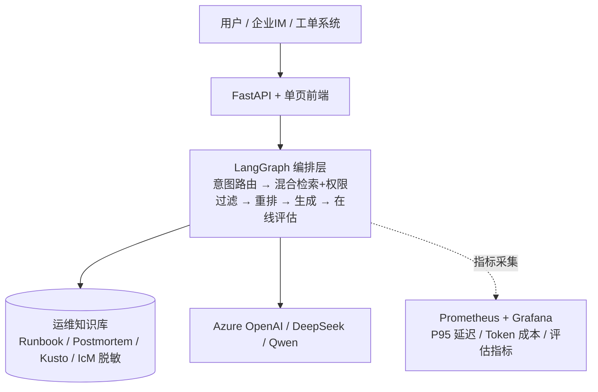
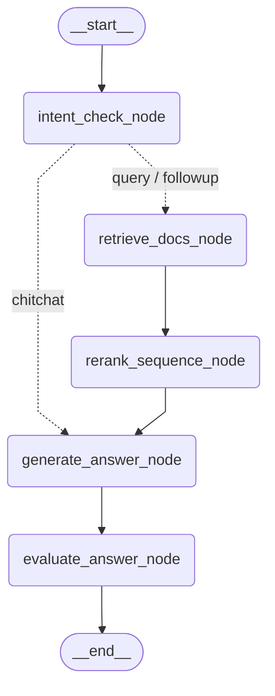

# 《运维知识库 Advance RAG 助手》原型设计文档

## 一、 项目概述与目标

### 1.1 背景
运维知识（Runbook、Postmortem、Kusto 查询模板、IcM 事件摘要）通常散落在多个系统，格式多样，且存在严格的权限隔离。传统关键词搜索无法理解语义，传统RAG仅靠向量做粗筛，极易因“字面相似但语义不符”召回大量噪音，导致大模型“垃圾进垃圾出”甚至产生幻觉。Advanced RAG引入重排（CrossEncoder/LLM）进行深度精筛，能大幅降噪并提取最切题的核心信息，从而显著提升大模型回答的质量与准确度。

### 1.2 对比传统 RAG 的提升

| 维度 | 传统 RAG | 本项目 |
|---|---|---|
| 检索 | 单一向量召回 | BM25+向量+RRF 混合，关键词/语义互补 |
| 排序 | 直接取 top-k | LLM/CrossEncoder 重排，附排名变化对比 |
| 成本 | 每次都全链路调 LLM | 意图路由：闲聊旁路检索、空召回直接兜底 |
| 可信度 | 答案无法验证 | [N] 引用溯源 + 权限过滤防越权 |
| 质量 | 无度量 | 双轨评估 + P95/Token 成本/命中率监控告警 |

### 1.3 核心目标
构建一个**企业级、可评估、可观测**的 Advanced RAG 助手原型：
- **准确**：混合检索 + 重排 + 引用溯源。
- **安全**：支持基于用户角色的文档级权限过滤。
- **可衡量**：RAGAS/DeepEval 评估 Faithfulness 与 Answer Relevancy。
- **可观测**：监控 P95 延迟、Token 成本、检索命中率。

---

## 二、 系统架构设计

### 2.1 总体架构图（Mermaid）



### 2.2 LangGraph 工作流（实际运行图）



### 2.3 测试界面


### 2.4 核心模块分层
1. **接入层**：FastAPI 提供 RESTful API，支持企业内部 IM 或工单系统调用。
2. **编排层**：LangGraph 管理多轮对话状态、意图识别、检索决策与生成。
3. **检索层**：Azure AI Search 混合检索（BM25 + Vector），Cross-Encoder 或 LLM 重排。
4. **数据层**：脱敏/合成的 Runbook、Postmortem、Kusto 模板、IcM 摘要。
5. **评估与观测层**：RAGAS/DeepEval 离线评估，Kusto/Prometheus 在线监控。

---

## 三、 数据层设计

### 3.1 数据源与脱敏
- **数据源**：Markdown/PDF 运维手册、Postmortem 报告、Kusto 查询语句、IcM 事件摘要。
- **脱敏要求**：使用合成数据或公开文档，删除所有真实客户信息、内部域名、API Key。
- **数据格式**：`data/raw/` 下按类别存放，例如 `runbooks/`、`postmortems/`。

### 3.2 数据预处理与 Ingestion
- **Chunking 策略**：
  - Markdown 按标题层级切分（H2/H3）。
  - 代码块（Kusto）单独切分，保留上下文注释。
  - Chunk size: 512 tokens，Overlap: 50 tokens。
- **Embedding**：Azure OpenAI `text-embedding-3-small` 或 `text-embedding-ada-002`。
- **索引设计（Azure AI Search）**：
  - 字段：`id`、`content`、`content_vector`、`source`、`category`、`allowed_groups`（权限过滤用）、`last_updated`。
  - 启用语义排序（Semantic Ranker）或自定义重排。

### 3.3 权限过滤设计
- 在 Azure AI Search 索引中增加 `allowed_groups` 字段（如 `["sre", "dev", "ops"]`）。
- 检索时通过 OData filter 注入用户组：`allowed_groups/any(g: g eq 'sre')`。
- 确保权限在检索阶段即被过滤，避免敏感信息进入 LLM 上下文。

---

## 四、 核心功能实现方案

### 4.1 混合检索（Hybrid Search）
- **关键词检索**：Azure AI Search BM25。
- **向量检索**：Azure AI Search 向量检索。
- **融合排序**：Reciprocal Rank Fusion (RRF) 合并结果。
- **重排（Rerank）**：
  - 方案 A：Azure AI Search Semantic Ranker。
  - 方案 B：本地 Cross-Encoder（如 `BAAI/bge-reranker-base`）。
  - 方案 C：LLM Rerank（用 LLM 对 Top-3 结果打分）。
- **最终输出**：Top-2 文档片段，附带引用来源。

### 4.2 多轮对话与 LangGraph 编排
- **状态定义**：
  ```python
  class GraphState(TypedDict, total=False):
      question: str
      user_group: str
      messages: list          # 多轮历史 [{"role": "user|assistant", "content": "..."}]
      intent: str             # query | followup | chitchat
      retrieved_docs: list     # 召回 + 重排后的文档
      citations: list          # 引用元信息 [{doc_id, source, category, snippet, score}]
      trace: list              # 编排步骤日志（前端实时展示）
      answer: str
      input_tokens: int
      output_tokens: int
      latency_ms: float
  ```
- **节点设计**（类 + `__call__`，配置走 `__init__`，LangGraph 调节点走可调用协议）：
  | 节点类 | LangGraph 节点名 | 依赖 | 职责 |
  |---|---|---|---|
  | `IntentCheckNode` | `intent_check_node` | 无 | 启发式识别 query / followup / chitchat |
  | `RetrieveDocsNode` | `retrieve_docs_node` | `Retriever`, `top_k` | 混合检索 + 权限过滤 |
  | `RerankSequenceNode` | `rerank_sequence_node` | `Reranker`, `final_top_k`, `strategy` | 重排 + 记录 before/after 对比 |
  | `GenerateAnswerNode` | `generate_answer_node` | `BaseLLMClient` | 组装 Prompt + 调 LLM，chitchat 用闲聊 Prompt |
  | `EvaluateAnswerNode` | `evaluate_answer_node` | `BaseLLMClient` | LLM 自评 Faithfulness / Relevancy / Hallucination |
- **条件边**：
  - `intent_check_node` → chitchat 直接跳 `generate_answer_node`（跳过检索/重排）
  - `intent_check_node` → query/followup → `retrieve_docs_node` → `rerank_sequence_node` → `generate_answer_node`
  - 检索为空时 `generate_answer_node` 返回 "未找到相关知识"，不调 LLM，节省 Token
  - `chitchat` / 无答案 / 无上下文 → `evaluate_answer_node` 标记 `skipped`

### 4.3 引用与权限过滤
- **引用**：在 Prompt 中要求 LLM 输出 `[1]`、`[2]` 引用，并在 API 返回中附带原始文档链接与片段。
- **权限**：检索阶段过滤，生成阶段不暴露无权限内容。

### 4.4 API 设计（FastAPI）
- `POST /chat`：接收 `question`、`user_group`、`session_id`，返回回答与引用。
- `POST /feedback`：接收用户对回答的评分（用于后续评估）。
- `GET /health`：健康检查。
- `GET /metrics`：暴露 Prometheus 指标。

---

## 五、 评估体系设计（RAGAS/DeepEval）

### 5.1 评估数据集构建
- 构建 `data/eval/qa.jsonl`，每行格式：
  ```json
  {"question": "如何排查 SharePoint 高延迟？", "ground_truth": "首先检查...", "context": "..."}
  ```
- 建议规模：100~300 条合成问答对。

### 5.2 评估指标
- **Faithfulness**：回答是否完全基于检索到的上下文。
- **Answer Relevancy**：回答是否切题。
- **Context Precision / Recall**：检索质量。
- **P95 Latency**：端到端延迟。
- **Token Cost**：每次请求的 Token 消耗。

### 5.3 自动化评估流水线
- 使用 GitHub Actions 或本地脚本定期运行：
  ```bash
  python -m eval.run_ragas --dataset data/eval/qa.jsonl
  python -m eval.run_deepeval --dataset data/eval/qa.jsonl
  ```
- 输出评估报告（Markdown/HTML），对比不同 Chunking/Rerank 策略。

---

## 六、 可观测性设计

### 6.1 指标采集
- **应用层**：FastAPI 中间件记录请求耗时、Token 消耗（使用 `tiktoken` 计算）。
- **检索层**：记录检索命中率、重排耗时。
- **LLM 层**：记录首 Token 延迟、总延迟、输入/输出 Token 数。

### 6.2 看板与告警
- **Kusto/Prometheus + Grafana**：
  - P95 延迟趋势图。
  - Token 成本趋势图。
  - 检索命中率与幻觉率。
  - 用户反馈评分分布。
- **告警规则**：
  - P95 延迟 > 5s。
  - Token 成本 > $X/天。
  - 幻觉率 > 5%。

---

## 七、 部署与 CI/CD

### 7.1 本地开发
```bash
python -m venv .venv
source .venv/bin/activate
pip install -r requirements.txt
cp .env.example .env
docker compose up -d  # 启动 Azure AI Search 模拟器或本地依赖
uvicorn app.main:app --reload
```

### 7.2 Docker 化
- `Dockerfile`：多阶段构建，减小镜像体积。
- `docker-compose.yml`：定义 API、Redis（缓存）、Prometheus、Grafana。

### 7.3 CI/CD
- GitHub Actions：
  - Lint：`ruff`、`mypy`。
  - Test：`pytest`，覆盖率 > 80%。
  - Eval：运行 RAGAS 评估，指标下降则阻断合并。
  - Build & Push：构建 Docker 镜像并推送到 GHCR。


## 十、 合规与安全
- 此项目由个人学习生成，所有数据均已脱敏，不包含任何机密数据、真实用户信息和 API Key。